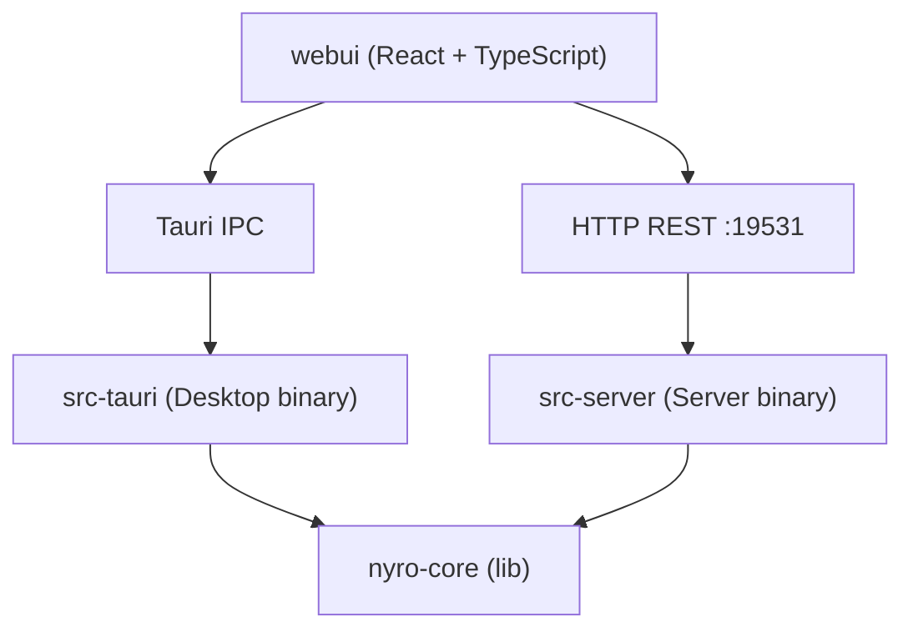

# Nyro AI Gateway — 架构设计

---

## 1. 产品定位与部署形态

Nyro 是一个 **AI 协议网关（AI Gateway）**：在 AI 客户端工具与模型提供商之间做实时协议转换与统一调度。任意使用 OpenAI / Anthropic / Gemini SDK 的客户端无需改代码，仅修改 `base_url` 即可路由到任意 LLM Provider。既可作为**桌面应用**本地零部署运行，也可作为**独立服务端**自托管或团队共享，管理与配置保持私有可控。

```
Claude Code · Codex CLI · Gemini CLI · OpenCode
     OpenAI SDK · Anthropic SDK · Gemini SDK
              Any HTTP API Client
                      ↓
              Nyro AI Gateway
            (localhost:19530)
                      ↓
    OpenAI · Anthropic · Google · DeepSeek
    MiniMax · xAI · Zhipu · Ollama · ...
```

**部署形态：**

| 形态 | 实现 | 适用场景 |
|---|---|---|
| Desktop | Tauri v2 桌面应用（macOS / Windows / Linux） | 个人开发者，零部署，数据不离开本机 |
| Server `--mode all` | 独立 Rust 二进制，Proxy + Admin API + 内嵌 WebUI | 自托管、团队共享（默认） |
| Server `--mode proxy` | 同上，仅启动代理端口 `:19530` | 分布式纯调度节点，无管理面 |
| Server `--mode admin` | 同上，仅启动管理端口 `:19531` | 内部系统对接控制面；可搭配 `--no-default-features`（slim）去除内嵌 WebUI |
| Server Standalone | `--config config.yaml`，MemoryStorage，无 Admin | 边缘/最小化部署，YAML 静态配置 |

核心原则：`nyro-core` 只暴露纯 Rust API（struct + async fn），**不感知传输层**。Desktop 版通过 Tauri IPC 调用，Server 版通过 HTTP REST 调用。

---

## 2. Workspace 分层

```
nyro/
├── Cargo.toml                   # Rust workspace
├── crates/
│   └── nyro-core/
│       └── src/
│           ├── lib.rs            # 13 个顶层 pub mod + Gateway / GatewayConfig 根类型
│           ├── proxy/            # 代理面
│           │   ├── mod.rs
│           │   ├── auth.rs
│           │   ├── client.rs     # ProxyClient（HTTP 调用封装）
│           │   ├── context.rs    # RequestContext / ContextBag
│           │   ├── handler.rs    # models_list 只读端点（≤110 行）
│           │   ├── intake.rs     # 请求接入预处理
│           │   ├── observability.rs  # 日志工具（header 脱敏、URL 脱敏等）
│           │   ├── security.rs   # 安全过滤
│           │   ├── server.rs     # axum HTTP Server 启动
│           │   ├── stream.rs     # StreamBridge 状态机
│           │   ├── dispatcher/   # 单点编排管线
│           │   │   ├── mod.rs        # dispatch_pipeline / dispatch / error_response
│           │   │   ├── accumulator.rs
│           │   │   ├── auth.rs       # authorize_model_access / get_provider
│           │   │   ├── non_stream.rs # handle_non_stream / handle_non_stream_via_upstream_stream
│           │   │   ├── stream.rs     # handle_stream
│           │   │   └── util.rs
│           │   ├── planner/      # 协议协商
│           │   │   ├── mod.rs        # ProtocolPlan / ProtocolMode 等 re-export
│           │   │   └── negotiator.rs # negotiate() / RoutingStrategy / OrderedStrategy
│           │   └── ingress/      # 5 个薄 ingress shell（按协议族分目录）
│           │       ├── mod.rs
│           │       ├── openai_compatible/
│           │       │   ├── mod.rs
│           │       │   ├── chat_completions.rs   # decode → dispatch_pipeline
│           │       │   └── embeddings.rs
│           │       ├── openai_responses/
│           │       │   ├── mod.rs
│           │       │   └── responses.rs
│           │       ├── anthropic_messages/
│           │       │   ├── mod.rs
│           │       │   └── messages.rs
│           │       └── google_generative/
│           │           ├── mod.rs
│           │           └── generate_content.rs
│           ├── plugin/           # 扩展框架（PluginKernel + 生命周期插点）
│           │   ├── mod.rs        # PluginKernel / CapabilityKind / PluginManifest
│           │   └── phase.rs      # Phase / PhaseHook / PhaseCtx / PhaseOutcome /
│           │                     # ResponseView / HostContext / ResponseStats /
│           │                     # PhaseHookRegistration / PhaseHookRegistry
│           ├── protocol/         # 协议转换引擎
│           │   ├── mod.rs        # ProviderProtocols / ResolvedEgress 等
│           │   ├── ids.rs        # ProtocolEndpoint（ProtocolId 为别名）/ ProtocolCapabilities
│           │   ├── traits.rs     # EndpointHandler trait + 6 个 codec trait
│           │   ├── registry.rs   # ProtocolRegistry / EndpointRegistration
│           │   ├── ir/           # 统一内部表示（IR）
│           │   │   ├── mod.rs
│           │   │   ├── request.rs   # AiRequest
│           │   │   ├── response.rs  # AiResponse
│           │   │   ├── stream.rs    # AiStreamDelta
│           │   │   ├── usage.rs     # Usage
│           │   │   └── ...          # envelope / ext / vendor_ext / cache / error 等
│           │   └── codec/        # 编解码器 + EndpointHandler 注册壳
│           │       ├── mod.rs
│           │       ├── reasoning.rs       # think-tag 提取工具
│           │       ├── tool_correlation.rs
│           │       ├── openai/
│           │       │   ├── compatible/    # chat_completions + embeddings
│           │       │   └── responses/     # OpenAI Responses API
│           │       ├── anthropic/
│           │       │   └── messages/
│           │       └── google/
│           │           └── gemini/
│           ├── provider/         # 厂商扩展层
│           │   ├── mod.rs
│           │   ├── vendor.rs     # Vendor trait / ProviderCtx / VendorRegistration
│           │   ├── vendor_ext.rs # VendorExtension trait / VendorCtx / ExtensionRegistration
│           │   ├── registry.rs   # VendorRegistry
│           │   ├── metadata.rs   # VendorMetadata / Label / AuthMode
│           │   ├── outbound.rs   # OutboundRequest
│           │   ├── inbound.rs    # InboundResponse
│           │   ├── common/
│           │   │   ├── openai.rs     # OpenAI 兼容共用逻辑
│           │   │   └── pipeline.rs   # 7 步 build_request / parse_response 自由函数
│           │   ├── openai/           # OpenAiVendor + OpenAIFamilyExt
│           │   │   └── codex/        # OpenAiCodexChannel（OAuth channel）
│           │   ├── anthropic/        # AnthropicVendor + AnthropicFamilyExt
│           │   │   └── claude_code/  # AnthropicClaudeCodeChannel
│           │   ├── google/           # GoogleVendor + GoogleFamilyExt
│           │   ├── vertexai/         # VertexVendor
│           │   ├── deepseek/ · moonshotai/ · zhipuai/ · minimax/
│           │   ├── xai/ · zai/ · nvidia/ · openrouter/ · ollama/ · custom/
│           │   └── ...
│           ├── admin/            # AdminService 管理面（按职责拆分）
│           │   ├── mod.rs
│           │   ├── extensions.rs # list_loaded_extensions（PluginKernel 聚合）
│           │   ├── providers.rs · oauth.rs · routes.rs · api_keys.rs
│           │   ├── settings.rs · observability.rs · import_export.rs
│           │   ├── model_catalog.rs · auth_data.rs · route_data.rs
│           │   └── session_tests.rs
│           ├── error.rs          # GatewayError taxonomy
│           ├── router/           # TargetSelector / HealthRegistry
│           ├── storage/          # 多后端存储（sqlite / postgres / mysql / memory）
│           ├── db/               # SQLite schema / migrate()
│           ├── logging/          # LogEntry / send_log
│           ├── cache/
│           ├── integrations/     # HookRegistry（旧版 request/response hook）
│           └── auth/
├── src-tauri/
├── src-server/
└── webui/
```

**依赖关系：**



**nyro-core 顶层 `pub mod`（lib.rs，共 13 个）：**

```
admin · auth · config · db · error · integrations · logging
plugin · protocol · provider · proxy · router · storage
```

**核心 API：**

```
Gateway::new(config)      → 初始化数据库、启动代理服务
Gateway::start_proxy()    → 启动 axum HTTP Server（代理面）
Gateway::admin()          → 返回 AdminService，提供全部管理操作
  ├── .list_models()
  ├── .create_model(input)
  ├── .list_providers()
  ├── .create_provider(input)
  ├── .test_provider(id)
  ├── .list_api_keys()
  ├── .query_logs(filter)
  ├── .get_stats_overview()
  ├── .list_loaded_extensions()  ← PluginKernel 聚合 manifest
  └── ...
Gateway::shutdown()       → 优雅关闭
```

`AdminService` 是管理面唯一入口；`admin/` 子模块按功能职责分布，不引入新传输层抽象。

---

## 3. 协议转换架构

### 3.1 核心设计原则

- **统一错误 taxonomy**：`GatewayError` 覆盖 15 种错误类型，每个错误有稳定 code、HTTP status、user message、internal detail 和 retryable 标志。
- **请求生命周期追踪**：`RequestContext` 携带 request_id、deadline、cancellation token、outcome，以及类型键扩展袋 `ContextBag`，端到端贯穿所有层（见 §4）。
- **确定性协议协商**：`negotiate()`（`proxy/planner/negotiator.rs`）实现三级 egress 解析（Exact → Same-family → Provider Default），`ProtocolRegistry` 统一别名规范化。
- **Pass-Through 已落地**：`ingress == egress` 且 `Vendor` 声明无请求/响应 mutation（`declared_request_mutations()` / `declared_response_mutations()` 均为 false）时，dispatcher 绕过 IR 往返，直接透传原始 body / SSE 字节，最小化延迟与 CPU 开销。
- **完整字段映射**：每个 codec 明确处理已知字段；vendor-specific 字段走三段化路径，不隐式丢弃。
- **Vendor 单点接口**：`dispatch_pipeline` 只通过 `Vendor` trait 与厂商层交互，一次注册覆盖请求/响应编解码与流式处理的完整生命周期。
- **五阶段生命周期**：请求/响应全程经过 OnRequest / OnAccess / OnUpstream / OnResponse / OnLog 五个插点，通过 `PhaseHook` 做非侵入扩展（见 §4）。

### 3.2 完整调用流程

```
+--------------------+                  +------------------------------------------+
| Client / CLI / SDK | -- HTTP/SSE --> | Ingress Shell（proxy/ingress/<family>/）   |
|                    |                  |  RequestContext 注入（axum Extension）      |
|                    |                  |  decode body → AiRequest（IR）             |
+--------------------+                  +-------------------+----------------------+
                                                            |
                                                            ▼
                                         +------------------------------------------+
                                         | dispatch_pipeline（薄包装）               |
                                         |  HostContext::new(&gw)                    |
                                         |  ↓ dispatch_pipeline_inner(ctx, req, host)|
                                         +-------------------+----------------------+
                                                            |
                                  ┌─ Phase ①  OnRequest ───┤  路由键派生前
                                  │  PhaseHook chain        │  可改写 request.model
                                  │  ShortCircuit → 直接返回 │  Reject → 渲染错误
                                  └─────────────────────────┤
                                                            │
                                              Route lookup（model_cache）
                                              Auth / Quota（authorize_model_access）
                                                            │
                                  ┌─ Phase ②  OnAccess ────┤  身份 + 路由已定
                                  │  PhaseHook chain        │  可 Reject（限流/鉴权策略）
                                  └─────────────────────────┤
                                                            │
                                         Target iteration（HealthRegistry 感知）
                                                            │
                                  ┌─────────── 每个 target ──────────────────────┐
                                  │  negotiate() → egress / base_url              │
                                  │  VendorRegistry.get_vendor(vendor_id)         │
                                  │                                               │
                                  │  ┌─ Phase ③  OnUpstream ──────────────────┐  │
                                  │  │  per-attempt（重试循环内）               │  │
                                  │  │  可 ShortCircuit（缓存命中）             │  │
                                  │  └────────────────────────────────────────┘  │
                                  │                                               │
                                  │  provider_ctx = ProviderCtx{...}              │
                                  │  build outbound（passthrough_run | 7 步）      │
                                  │  CallCtx{ req_ext = ctx.extensions.clone() }  │
                                  │                                               │
                                  │  ┌────────────── handlers ──────────────────┐ │
                                  │  │ is_stream                                 │ │
                                  │  │  → handle_stream                          │ │
                                  │  │    · IR path: spawn 内逐 AiStreamDelta    │ │
                                  │  │        ┌─ Phase ④ OnResponse(Stream) ─┐  │ │
                                  │  │    · SSE passthrough: 不接 OnResponse   │ │
                                  │  │ force_upstream_stream                    │ │
                                  │  │  → handle_non_stream_via_upstream_stream  │ │
                                  │  │        ┌─ Phase ④ OnResponse(Full) ──┐  │ │
                                  │  │ else                                     │ │
                                  │  │  → handle_non_stream                     │ │
                                  │  │        ┌─ Phase ④ OnResponse(Full) ──┐  │ │
                                  │  │    · LogBuilder.emit()                   │ │
                                  │  │        └▶ 注入 ResponseStats → ctx.ext  │ │
                                  │  └──────────────────────────────────────────┘ │
                                  │  status<400 → record_success, return          │
                                  │  retryable → continue; else → return          │
                                  └───────────────────────────────────────────────┘
                                                            │
                                         ┌─ Phase ⑤  OnLog ┤  单一汇聚点（所有返回路径）
                                         │  fire-and-forget │  只读 ctx.extensions 的
                                         │  不可改/不可短路  │  ResponseStats 快照
                                         └──────────────────┤
                                                            │
                                              Return to Client（JSON / SSE）
```

### 3.3 内部表示（IR）

位于 `crates/nyro-core/src/protocol/ir/`，定义统一内部结构：

- `AiRequest`（`ir/request.rs`）：入站请求，含消息列表、工具定义、模型参数
- `AiResponse`（`ir/response.rs`）：出站响应，含 content / tool_calls / usage / reasoning_content
- `AiStreamDelta`（`ir/stream.rs`）：流式增量事件，支持 reasoning delta、text、tool_call
- `Usage`（`ir/usage.rs`）：prompt_tokens / completion_tokens / total_tokens / cache_read_tokens

**vendor-specific 字段命名约定（存于 IR extra 字段）：**

| 前缀 | 用途 |
|---|---|
| `__anthropic_raw_*` | Anthropic cache_control / exotic blocks 无损往返 |
| `__google_raw_*` | Google systemInstruction / built-in tools / generationConfig |
| `__emb_*` | Embeddings 已知字段（input / dimensions / encoding_format / user） |
| `__vendor_ingress` | 未知 vendor 字段集合（由 VendorFieldPolicy 决定是否转发） |

---

## 4. 请求生命周期与扩展框架

> 权威设计文档：[docs/design/lifecycle.md](lifecycle.md)。本节提供概要，细节以 RFC 为准。

### 4.1 五阶段定义

| 阶段 | 时机 | 可做的事 | PhaseOutcome |
|---|---|---|---|
| **OnRequest** | 路由键派生前 | 改写 `request.model`、添加头 | Continue / ShortCircuit / Reject |
| **OnAccess** | 鉴权完成后 | 限流拒绝、自定义 ACL | Continue / ShortCircuit / Reject |
| **OnUpstream** | 上游调用前，per-attempt | 缓存命中短路、参数注入 | Continue / ShortCircuit / Reject |
| **OnResponse** | 响应解码后（非流式: Full；流式: 逐 delta） | 整形输出、屏蔽字段、写缓存 | Continue / ShortCircuit / Reject（非流式）；仅 Continue（流式） |
| **OnLog** | 管线边界（所有返回路径汇聚后） | 只读采样、指标上报、外部投递 | Continue（终态，不可短路） |

### 4.2 核心类型

```rust
// 钩子接口（inventory::submit! 注册，进程内静态链接）
#[async_trait]
pub trait PhaseHook: Send + Sync {
    fn name(&self) -> &'static str;
    fn phase(&self) -> Phase;
    async fn run(&self, ctx: &mut PhaseCtx<'_>) -> PhaseOutcome;
}

// 每次调用时传给 hook 的上下文四件套
pub struct PhaseCtx<'a> {
    pub req_ctx:  &'a mut RequestContext,  // 端到端请求上下文（含 ContextBag）
    pub request:  &'a mut AiRequest,       // 协议中性 IR
    pub response: ResponseView<'a>,        // Pending / Full / Stream
    pub host:     &'a HostContext<'a>,     // 网关能力边界（存储/配置/HTTP 等）
}

// ResponseStats: emit() 单点注入，OnLog 及 OnLogHook 读取
pub struct ResponseStats {
    pub client_status:       u16,
    pub upstream_status:     Option<u16>,
    pub usage:               Usage,
    pub upstream_latency_ms: Option<i64>,
    pub ttfb_ms:             Option<i64>,
    pub stream_chunks:       u32,
}
```

### 4.3 数据通道

```
RequestContext.extensions: ContextBag
  └─ 类型键（TypeId）→ Box<dyn Any + Send + Sync>
     共享引用（Arc<Mutex<HashMap>>），clone 后仍指向同一份数据

写入：LogBuilder::emit() → ctx.extensions.insert::<ResponseStats>(...)
读取：OnLog / OnLogHook → ctx.extensions.get::<ResponseStats>()
```

### 4.4 PluginKernel 与 admin 视图

`PluginKernel`（`plugin/mod.rs`）聚合所有 `inventory` 注册表：

```
PluginKernel::global()
  ├── HookRegistry（旧版 integrations）
  ├── VendorRegistry
  ├── ProtocolRegistry
  └── PhaseHookRegistry
        → manifests() → [{id, capability}]
              ↓
        GET /api/v1/system/extensions
        Tauri: get_loaded_extensions
        WebUI: /extensions 只读页
```

### 4.5 框架级 vs 插件级（当前状态）

```
框架级 ✅ 已交付
  五个 PhaseHook 插点接线（OnRequest/OnAccess/OnUpstream/OnResponse/OnLog）
  RequestContext.extensions（ContextBag）端到端贯穿
  ResponseStats 单点注入（emit()）
  HostContext 稳定边界
  PhaseHookRegistry（inventory 注册，空注册表零开销 no-op）
  PluginKernel + admin "已加载扩展" 只读视图

插件级 🔲 待做（A4）
  限流插件（OnAccess → Reject）
  语义缓存插件（OnUpstream ShortCircuit + OnResponse 落缓存）
  可观测性 exporter（OnLog 消费 ResponseStats → OTel / Prometheus）
```

---

## 5. 协议层（codec/）详情

### 5.1 EndpointHandler 注册体系

每个 dialect 的注册壳位于 `codec/<family>/<dialect>/` 对应目录，通过 `inventory::submit!` 自动注册进 `ProtocolRegistry`：

```rust
inventory::submit! {
    EndpointRegistration { make: || Box::new(XxxHandler) }
}
// ProtocolRegistration 为 EndpointRegistration 的向后兼容别名
```

| 目录 | 注册的 ProtocolId（ProtocolEndpoint） |
|---|---|
| `codec/openai/compatible/` | `openai/chat/v1`、`openai/embeddings/v1` |
| `codec/openai/responses/` | `openai/responses/v1` |
| `codec/anthropic/messages/` | `anthropic/messages/2023-06-01` |
| `codec/google/gemini/` | `google/generate/v1beta` |

`ProtocolId` 现为 `ProtocolEndpoint`（`protocol/ids.rs`）的类型别名，保持向后兼容。

### 5.2 EndpointHandler trait 与 codec trait

`EndpointHandler`（原 `ProtocolHandler`，`protocol/traits.rs`）：

```rust
trait EndpointHandler: Send + Sync {
    fn id(&self) -> ProtocolEndpoint;
    fn capabilities(&self) -> ProtocolCapabilities;
    fn make_request_decoder(&self)         -> Box<dyn RequestDecoder>;
    fn make_request_encoder(&self)         -> Box<dyn RequestEncoder>;
    fn make_response_decoder(&self)        -> Box<dyn ResponseDecoder>;
    fn make_response_encoder(&self)        -> Box<dyn ResponseEncoder>;
    fn make_stream_response_decoder(&self) -> Box<dyn StreamResponseDecoder>;
    fn make_stream_response_encoder(&self) -> Box<dyn StreamResponseEncoder>;
}
```

6 个 codec trait（`protocol/mod.rs`）：`RequestDecoder`、`RequestEncoder`、`ResponseDecoder`、`ResponseEncoder`、`StreamResponseDecoder`、`StreamResponseEncoder`。流式解析在 protocol 层（`StreamResponseDecoder::parse_chunk` / `finish`），**非** Vendor 层。

### 5.3 ProtocolCapabilities 矩阵

| 字段 | 类型 | 含义 |
|---|---|---|
| `streaming` | bool | 支持 SSE 流式 |
| `tools` / `function_calling` | bool | 支持 tool call |
| `reasoning` / `extended_reasoning` | bool | 支持 thinking / reasoning |
| `embeddings` | bool | Embeddings 端点 |
| `force_upstream_stream` | bool | 强制上游 streaming（Responses API） |
| `override_model_in_body` | bool | model 写入 URL path（Google） |
| `unknown_field_policy` | VendorFieldPolicy | Pass / Drop |
| `lossy_default_reject` | bool | lossy 转换默认拒绝 |

### 5.4 Codec 完整字段映射

**OpenAI Chat**：完整映射 logprobs、seed、response_format、parallel_tool_calls、audio 等 20+ 字段；reasoning 字段透传。

**OpenAI Responses**：`force_upstream_stream=true`；独立 decoder/encoder/parser/formatter；reasoning_item 的 summary text 提取。

**Anthropic Messages**：cache_control、thinking config、context_management、exotic blocks（Document / InputAudio）保留 `__anthropic_raw_*` 做无损往返；built-in tools（web_search_call）作为 sentinel ToolDef 处理。

**Google GenerateContent**：完整 generationConfig（20+ fields）、safety_settings、built-in tools（googleSearch / codeExecution）；`__google_generation_config` 在 encoder 中被 model 参数 overlay。

**OpenAI Embeddings**：`VendorFieldPolicy::Drop`；`__emb_*` 明确解析；unknown fields 进 `__vendor_ingress` 但不转发。

### 5.5 语义工具（codec/reasoning.rs & codec/tool_correlation.rs）

**reasoning.rs**：
- `normalize_response_reasoning`：结构化字段优先，`<think>` tag 兜底提取
- `split_think_tags`：多 `<think>` block 支持，未闭合 tag 保留为文本

**tool_correlation.rs**：`normalize_request_tool_results`，统一 tool_call_id 关联（精确 ID → content hint → 工具名 hint → FIFO fallback → 自动补合成 assistant message）。

---

## 6. 厂商扩展层（provider/）

三层职责分离：

```
protocol/codec/   ← 序列化层：AiRequest/AiResponse ↔ wire-format JSON
provider/         ← 编排层：Vendor trait（build_request / parse_response）+ VendorExtension hooks
```

### 6.1 Vendor trait（原 ProviderAdapter）

`dispatcher` 的唯一接触点（`provider/vendor.rs`）：

```rust
#[async_trait]
pub trait Vendor: Send + Sync + 'static {
    // 标识 / 元数据
    fn scope(&self) -> VendorScope;              // Vendor | Channel
    fn vendor_id(&self) -> &'static str;
    fn supported_protocols(&self) -> &'static [ProtocolId];
    fn metadata(&self) -> &'static VendorMetadata;

    // Auth / URL
    fn auth_headers(&self, ctx: &VendorCtx) -> HeaderMap;
    fn build_url(&self, ctx: &VendorCtx, base_url: &str, path: &str) -> String;

    // 编解码 hook（可选，默认 no-op）
    async fn pre_request(&self, ctx, req: &mut AiRequest, gw: &Gateway);
    async fn pre_encode(&self, ctx, req: &mut AiRequest);
    async fn post_encode(&self, ctx, body: &mut Value, headers: &mut HeaderMap);
    async fn pre_parse(&self, ctx, body: &mut Value);
    async fn post_parse(&self, ctx, resp: &mut AiResponse);

    // 流式 hook
    async fn on_stream_raw_chunk(&self, ctx, chunk: &str);
    async fn on_stream_delta(&self, ctx, delta: &mut AiStreamDelta);

    // 编排（required）
    async fn build_request(&self, req: &mut AiRequest, ctx: &ProviderCtx)
        -> Result<OutboundRequest, GatewayError>;
    async fn parse_response(&self, resp: InboundResponse, ctx: &ProviderCtx)
        -> Result<AiResponse, GatewayError>;
    fn map_error(&self, status: u16, body: Value) -> GatewayError;
    fn validate_environment(&self, provider: &Provider) -> Result<(), GatewayError>;

    // PassThrough 声明（no mutation → dispatcher 走 passthrough 路径）
    fn declared_request_mutations(&self) -> bool { false }
    fn declared_response_mutations(&self) -> bool { false }
}
```

**7 步 build_request pipeline**（`provider/common/pipeline.rs`）：
`pre_request` → `normalize_tool_results` → `pre_encode` → `codec_encode` → `post_encode` → `auth_headers` → `build_url`

**ProviderCtx**（`provider/vendor.rs`）：

```rust
pub struct ProviderCtx<'a> {
    pub provider:             &'a Provider,
    pub protocol:             ProtocolId,        // 即 ProtocolEndpoint
    pub egress_base_url:      &'a str,
    pub api_key:              &'a str,
    pub actual_model:         &'a str,
    pub credential:           Option<&'a StoredCredential>,
    pub gw:                   &'a Gateway,
    pub disable_default_auth: bool,
}
```

### 6.2 VendorExtension（channel / family ext）

`VendorExtension`（`provider/vendor_ext.rs`）仍存在，包含 9 个 hook（auth_headers / build_url / pre_encode / post_encode / pre_parse / post_parse / on_stream_raw_chunk / on_stream_delta / pre_request）。

**关系：**
- `Vendor` 通过 blanket `impl<T: Vendor> VendorExtension for T` 自动实现 `VendorExtension`
- Channel-only 类型（`OpenAiCodexChannel`、`AnthropicClaudeCodeChannel`）仅 impl `VendorExtension`

**两套注册（均通过 `inventory::submit!`）：**

```rust
// 完整 vendor
inventory::submit! { VendorRegistration { make: || Box::new(XxxVendor) } }
// Channel / family ext
inventory::submit! { ExtensionRegistration { make: || Box::new(XxxChannel) } }
```

`VendorRegistry::resolve(provider, protocol_id)` 返回 `Arc<dyn VendorExtension>`，内部通过 `VendorAsExt` 包装统一两类注册。

### 6.3 共用 helpers（provider/common/openai.rs）

所有 OpenAI 兼容厂商共用：`openai_bearer_auth_headers`、`openai_build_url`、`openai_map_error`、`openai_compat_build_request`、`openai_compat_parse_response`、`GenericOpenAICompatibleAdapter`、`ThinkTagExtractingParser`。

### 6.4 厂商列表

| 厂商 | vendor_id | 特殊处理 |
|---|---|---|
| OpenAI | `openai` | 含 `codex` channel（OAuth） |
| Anthropic | `anthropic` | `x-api-key` + `anthropic-version`；含 `claude-code` channel |
| Google | `google` | URL 追加 `?key=<api_key>`；`override_model_in_body=true` |
| Vertex AI | `vertexai` | Service account auth + 区域 endpoint |
| DeepSeek / Moonshot / Zhipu / MiniMax / xAI / ZAI / OpenRouter / Nvidia / Ollama | 各自 vendor_id | 委托 `GenericOpenAICompatibleAdapter` / openai_compat_* |
| custom | `custom` | 用户自定义 vendor preset |

---

## 7. 错误处理

`GatewayError` 统一 taxonomy：

| 变体 | HTTP | 含义 |
|---|---|---|
| `BadRequest` | 400 | 客户端格式错误 |
| `Unauthorized` | 401 | 无有效 API Token |
| `Forbidden` | 403 | Token 状态异常或无权限 |
| `QuotaExceeded` | 429 | RPM / TPM / TPD 超限 |
| `RouteNotFound` | 404 | 无匹配模型/路由 |
| `ProtocolUnsupported` | 400 | 协议不支持 |
| `ProtocolLossyRejected` | 422 | lossy 转换被拒绝 |
| `ProviderUnavailable` | 503 | 无可用 vendor extension |
| `UpstreamStatus` | 上游 status | 上游返回错误 |
| `UpstreamTimeout` | 504 | 上游超时 |
| `StreamParseError` | 502 | SSE chunk 解析失败 |
| `ClientCancelled` | 499 | 客户端断开 |
| `Internal` | 500 | 内部错误 |

每个错误由 `GatewayError::render(request_id)` 统一序列化为 OpenAI 兼容 JSON 错误格式。

---

## 8. 模型（路由）与访问控制

### 8.1 Model 模型（原 Route）

模型唯一键为 `name`，客户端请求中的 `model` 值与之精确匹配即命中：

| 字段 | 类型 | 说明 |
|---|---|---|
| `id` | TEXT PK | UUID |
| `name` | TEXT | 显示名称，同时作为模型匹配键 |
| `balance` | TEXT | 负载策略：`weighted` / `priority` / `cooldown` / `latency` |
| `target_provider` | TEXT FK | 默认目标 Provider（兜底）|
| `target_model` | TEXT | 默认上游模型名 |
| `enable_auth` | BOOL | API Token 访问控制，默认 false |
| `enable_payload` | BOOL/NULL | 是否记录 payload；NULL 时跟随全局开关 |
| `is_enabled` | BOOL | 模型启用状态，默认 true |

> `ingress_protocol` 不在数据库中。协议在运行时由 `RequestContext` 携带，日志写入 `request_logs.client_protocol`。

**后端列表（model_backends）**：一个 Model 可绑定多个 backend，每个 backend 指向 `provider_id` + `model`，带 `weight`（weighted balance）和 `priority`（priority balance）；后端健康状态在内存 `HealthRegistry` 管理，不入库。

### 8.2 API Token 模型

Model 与 API Token 是**独立管理、多对多绑定**的关系（经 `api_key_models` 表）：

```
API Token ──── (授权绑定) ──── Model
  │                             │
  ├── 配额: RPM / RPD / TPM / TPD  ├── 匹配键 (name)
  ├── 过期时间                  ├── 后端列表 (model_backends)
  ├── 状态: is_enabled           ├── 负载策略 (balance)
  └── 名称                       └── 访问控制 (enable_auth)
```

Token 格式：`sk-<32位hex>`（存储字段名 `token`）。

### 8.3 代理请求鉴权流程

```
1. 解析请求 → 提取 model, api_token
   (优先级: Authorization: Bearer > x-api-key)
2. match(model) → models 表精确匹配 name
   └── 未匹配 → GatewayError::RouteNotFound (404)
3. if model.enable_auth == false:
   └── 直接放行
4. if api_token 为空 → GatewayError::Unauthorized (401)
5. 验证 api_token:
   a. 不存在 → 401 invalid token
   b. is_enabled == false → 403 token revoked
   c. expires_at < now → 403 token expired
   d. model 不在 token 绑定列表（api_key_models）→ 403 forbidden
   e. 配额超限 (rpm / tpm / tpd) → GatewayError::QuotaExceeded (429)
6. 执行路由转发 → model_backends → 健康感知 target 选择
```

---

## 9. 模型能力识别

### 9.1 ai:// 内部协议

Provider 配置中通过 `modelsSource` / `capabilitiesSource` 声明数据来源：

| 值类型 | 示例 | 说明 |
|---|---|---|
| HTTP URL | `https://api.openai.com/v1/models` | 直接向 HTTP 端点请求 |
| 内部协议 | `ai://models.dev/openai` | 从 Nyro 内嵌 / 缓存的 models.dev 数据中查询 |

### 9.2 VendorMetadata

每个厂商通过 `const METADATA: VendorMetadata`（位于 `provider/<vendor>/mod.rs`）声明，由 `VendorRegistry::list_metadata_for_webui()` 聚合输出给 WebUI。

---

## 10. 存储与数据层

### 10.1 多后端

| 后端 | 适用形态 | 路径 |
|---|---|---|
| SQLite | Desktop（单用户本地） | `crates/nyro-core/src/storage/sqlite/` |
| PostgreSQL | Server（多用户自托管） | `crates/nyro-core/src/storage/postgres/` |
| MySQL | Server（多用户自托管） | `crates/nyro-core/src/storage/mysql.rs` |
| Memory | 测试 / mock | `crates/nyro-core/src/storage/memory.rs` |

统一接口定义在 `crates/nyro-core/src/storage/traits.rs`，上层代码不感知具体后端。
权威 Schema 文档：[docs/database/schema.md](../database/schema.md)（含 `deploy/schema/postgres.sql` / `mysql.sql`）。

### 10.2 核心表结构（最终态，post-migration）

> 历史迁移：`routes` → `models`，`route_targets` → `model_backends`，`api_key_routes` → `api_key_models`，`api_keys.key` → `api_keys.token`。

```sql
-- 提供商配置
CREATE TABLE providers (
    id              TEXT PRIMARY KEY,
    name            TEXT NOT NULL,
    vendor          TEXT,             -- canonical vendor_id
    protocol        TEXT NOT NULL,
    base_url        TEXT NOT NULL,
    api_key         TEXT NOT NULL,    -- static api key
    auth_mode       TEXT NOT NULL,
    use_proxy       INTEGER NOT NULL DEFAULT 0,
    is_enabled      INTEGER NOT NULL DEFAULT 1,
    created_at      TEXT NOT NULL,
    updated_at      TEXT NOT NULL
);

-- 模型（路由规则）
CREATE TABLE models (
    id              TEXT PRIMARY KEY,
    name            TEXT NOT NULL UNIQUE,  -- 匹配键 + 显示名
    balance         TEXT NOT NULL DEFAULT 'weighted',
    target_provider TEXT NOT NULL REFERENCES providers(id),
    target_model    TEXT NOT NULL,
    enable_auth     INTEGER NOT NULL DEFAULT 0,
    enable_payload  INTEGER,               -- NULL = 跟随全局
    is_enabled      INTEGER NOT NULL DEFAULT 1,
    created_at      TEXT NOT NULL
);

-- 模型后端列表
CREATE TABLE model_backends (
    id          TEXT PRIMARY KEY,
    model_id    TEXT NOT NULL REFERENCES models(id) ON DELETE CASCADE,
    provider_id TEXT NOT NULL REFERENCES providers(id),
    model       TEXT NOT NULL,        -- 上游实际模型名
    weight      INTEGER NOT NULL DEFAULT 100,
    priority    INTEGER NOT NULL DEFAULT 1,
    created_at  TEXT NOT NULL
);

-- 访问控制 Token
CREATE TABLE api_keys (
    id         TEXT PRIMARY KEY,
    token      TEXT NOT NULL UNIQUE,  -- sk-<32位hex>
    name       TEXT NOT NULL,
    rpm        INTEGER,
    rpd        INTEGER,
    tpm        INTEGER,
    tpd        INTEGER,
    is_enabled INTEGER NOT NULL DEFAULT 1,
    expires_at TEXT
);

-- Token 与 Model 的绑定关系
CREATE TABLE api_key_models (
    api_key_id TEXT NOT NULL REFERENCES api_keys(id) ON DELETE CASCADE,
    model_id   TEXT NOT NULL REFERENCES models(id) ON DELETE CASCADE,
    PRIMARY KEY (api_key_id, model_id)
);

-- 请求日志（append-only，快照，无 FK）
CREATE TABLE request_logs (
    id                        TEXT PRIMARY KEY,
    created_at                INTEGER NOT NULL,  -- Unix 毫秒
    api_key_id                TEXT,
    api_key_name              TEXT,
    client_protocol           TEXT,              -- ingress 协议
    upstream_protocol         TEXT,              -- egress 协议
    provider_id               TEXT,
    provider_name             TEXT,
    model_id                  TEXT,
    model_name                TEXT,
    upstream_url              TEXT,
    client_model              TEXT,
    upstream_model            TEXT,
    method                    TEXT,
    path                      TEXT,
    upstream_status_code      INTEGER,
    client_status_code        INTEGER NOT NULL,
    latency_total_ms          INTEGER,
    latency_upstream_ms       INTEGER,
    input_tokens              INTEGER,
    output_tokens             INTEGER,
    cache_read_tokens         INTEGER,
    is_stream                 INTEGER,
    stream_chunks_count       INTEGER,
    stream_first_chunk_ms     INTEGER,
    -- payload（仅 enable_payload=true 时填充）
    client_request_headers    TEXT,
    client_request_body       TEXT,
    client_response_headers   TEXT,
    client_response_body      TEXT,
    upstream_request_headers  TEXT,
    upstream_request_body     TEXT,
    upstream_response_headers TEXT,
    upstream_response_body    TEXT
);

-- 全局配置 KV
CREATE TABLE settings (
    name       TEXT PRIMARY KEY,
    value      TEXT NOT NULL,
    updated_at TEXT NOT NULL
);

-- OAuth 凭据（与 providers 1:1）
CREATE TABLE provider_oauth_credentials (
    provider_id    TEXT PRIMARY KEY REFERENCES providers(id) ON DELETE CASCADE,
    driver_key     TEXT NOT NULL,
    scheme         TEXT NOT NULL,
    access_token   TEXT,
    refresh_token  TEXT,
    expires_at     TEXT,
    status         TEXT NOT NULL,
    last_error     TEXT,
    created_at     TEXT NOT NULL,
    updated_at     TEXT NOT NULL
);
```

> 后端健康状态（熔断 / 成功率）在运行时内存 `HealthRegistry`（`router/health.rs`）管理，**不持久化到数据库**。

### 10.3 安全

- Desktop 模式下管理 API 仅监听 `127.0.0.1`，外部不可访问
- Server 模式下管理端口与代理端口独立，可配置鉴权

---

## 11. 前端适配层

前端（`webui/`）通过薄抽象层兼容两种部署形态（`webui/src/lib/backend.ts`）：

- **Desktop 版**：通过 Tauri IPC（`invoke(cmd, args)`）调用
- **Server 版**：通过 HTTP 调用（`fetch(/api/v1/...)`）

**技术栈：**

| 层 | 技术 |
|---|---|
| 框架 | React 19 + TypeScript + Vite |
| 状态 | Zustand |
| 数据获取 | TanStack Query |
| 路由 | React Router v7 |
| 样式 | Tailwind CSS 4 |
| 图表 | Recharts |

---

## 12. 未实施能力 / Future Work

### 12.1 Pass-Through 路径 ✅ 已实现

当 ingress/egress 协议一致且 `Vendor` 声明无 mutation（`declared_request/response_mutations()` 均为 false）时，dispatcher 走 passthrough 路径，绕过 IR 解析直接透传 body / SSE 字节，最小化延迟。

### 12.2 Quota 预留与结算

当前 quota 检查仅在请求前执行，并发场景存在超额风险。建议改为：preflight 估算 → atomic 预留 → 执行请求 → settle 实际用量 → refund 未消费预留。stream 客户端 cancel 时也需结算已产生的 token。

### 12.3 Fixture 契约测试体系

```
tests/fixtures/protocol/
  openai_chat/ · openai_responses/ · anthropic_messages/ · google_generate/

tests/contract/
  openai_chat_to_anthropic.rs  anthropic_to_openai_chat.rs  ...

tests/stream/
  normal_done.rs  upstream_disconnect.rs  malformed_chunk.rs
  client_cancel.rs  usage_in_final_chunk.rs
```

### 12.4 Compatibility Matrix CI

自动化验证每个 ingress→egress protocol 组合的支持程度（Native / Transform / LossyTransform / Reject），在 CI 生成兼容性报告，防止回归。

### 12.5 Record-Replay

捕获真实上游请求/响应 pair，存为 fixture，用于离线复现 bug、provider 更新后兼容性测试、流式异常场景精确重放。

### 12.6 可观测性 Exporter（Plugin-Level）

OnLog 阶段 + `ResponseStats` 已提供标准化的请求指标消费点（见 §4）。下一步：通过 `PhaseHook`（`OnLog`）实现 exporter 插件，输出 trace / metrics / logs 到 OTel Collector / Jaeger / Prometheus / Grafana 等平台。详见 [docs/design/lifecycle.md](lifecycle.md)。

### 12.7 长尾厂商适配

当前覆盖主流厂商（OpenAI / Anthropic / Google / Vertex AI / DeepSeek / Moonshot / Zhipu / MiniMax / xAI / ZAI / OpenRouter / Nvidia / Ollama）。待补充：
- AWS Bedrock（SigV4 签名 + wrapper protocol）
- Azure AI Foundry（Azure AD token + deployment URL pattern）
- Cohere / Mistral / Together AI 等

### 12.8 Router 故障策略（部分已落地）

已落地：多 backend 健康感知迭代（`HealthRegistry`）+ `balance` 策略（weighted / priority / cooldown / latency）+ 可重试状态码自动续跑。待补充：指数退避 + jitter、可配置重试上限、单 backend 精细化熔断（滑动窗口）。

### 12.9 Transport 策略

- HTTP/2 上游连接（降低延迟，复用连接）
- 连接池配置（per-provider max connections）
- 请求级超时精细化（connect_timeout / read_timeout / total_timeout 分离）
- 可配置重试策略
