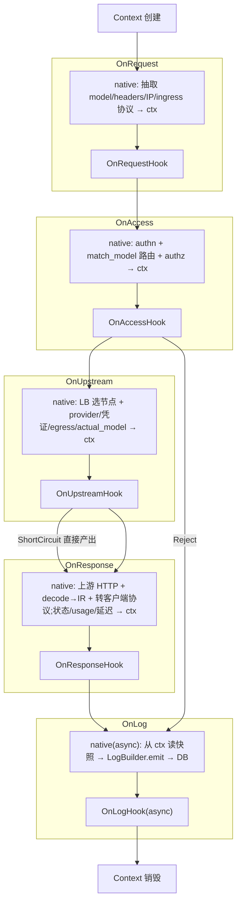
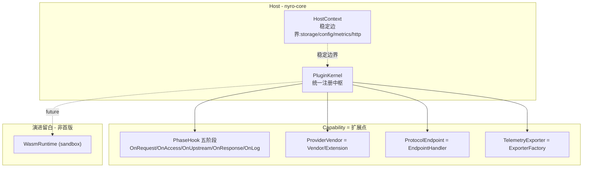

# Nyro 请求生命周期与扩展框架设计 RFC

> 状态:Draft · 关联文档:[observability.md](./observability.md)(可观测性 exporter 是本框架的 `TelemetryExporter` capability)、[architecture.md](./architecture.md)

---

## 1. 背景与目标

Nyro 正在从"本地代理网关"演进为工业级 AI 网关。当前的请求处理散落在 `proxy/dispatcher`、`integrations/hooks`、`provider`、`protocol` 等模块,扩展点(`RequestHook`/`ResponseHook`、`Vendor`、`EndpointHandler`)各自为政,缺少一个统一的**请求生命周期执行模型**。

本 RFC 定义一套 **固定阶段(Phase)+ 原生逻辑(Native)+ 阶段 Hook + 全程 Context** 的请求处理管线,借鉴 nginx / OpenResty 的分阶段思想,但采用 Nyro 原生语义(操作协议中立 IR,而非字节流)。

### 设计目标

- **用固定的少数阶段覆盖完整请求生命周期**:新需求是"往已有阶段挂 Hook",而不是不断新增阶段。
- **原生逻辑与扩展分离**:每个阶段有网关自带的原生步骤(authn / 路由 / 负载均衡 / 上游调用 / 日志),Hook 是挂在其旁的外部插入点。
- **Context 贯穿全局**:一个 `RequestContext`(Nyro 版 `ngx.ctx`)从创建到销毁贯穿所有阶段,承载身份、路由、扩展数据与 `request_id` 关联。
- **可治理 / 可观测**:扩展统一纳管(manifest、能力列表),可在 admin 列出;失败隔离明确。
- **向后兼容**:现有 `HookRegistry` / `VendorRegistry` / `ProtocolRegistry` 平滑纳入。

### 非目标

- 首版不做动态加载 / WASM 形式的扩展(见 §9 执行模型决策,预留演进)。

---

## 2. 核心模型:请求生命周期管线

每个阶段 = **原生步骤(Native)** + 紧随其后的 **阶段 Hook 插入点**。Context 全程贯穿。

```
Context 创建
  │
  ├─ OnRequest    [native: 抽取请求自带信息 → ctx]   → OnRequestHook   (改写 / 规范化 / 打标记)
  ├─ OnAccess     [native: authn + 路由解析 + authz → ctx] → OnAccessHook (鉴权 / 限流 / 拦截)
  ├─ OnUpstream   [native: 负载均衡选节点 + 解析 provider/凭证/egress → ctx] → OnUpstreamHook (短路 / 改节点)
  ├─ OnResponse   [native: 上游 HTTP 调用 + 收响应 + decode→IR + 转客户端协议;状态/usage/延迟 → ctx] → OnResponseHook (响应整形 / 流式逐 chunk)
  └─ OnLog        [native(async): 从 ctx 读快照 → LogBuilder.emit → DB] → OnLogHook(async) (metrics / trace / 投递外部组件)
  │
Context 销毁  (TelemetryGuard / ctx Drop,flush)
```



---

## 3. 各阶段详解(映射 Nyro 现状)

| 阶段 | 原生逻辑(对应代码) | 注入 ctx | Hook 能做什么 | 可见上下文 |
|---|---|---|---|---|
| **OnRequest** | decode → `AiRequest`;抽取 model 名、headers、IP、ingress 协议 | routing key、原始信息 | 改写 routing key、参数规范化/钳制、内容预处理、按 ingress 协议分支、打标记 | 原始 `AiRequest` + headers/IP + ingress 协议(**无**身份/路由) |
| **OnAccess** | authn(`find_api_key`,`dispatcher/auth.rs`)+ 路由解析(`match_model`,`dispatcher/mod.rs:99`)+ authz(`enable_auth`/model 绑定/rpm·配额) | `api_key_id`、鉴权参数、`model_id`、`route` | 自定义鉴权、限流、配额、内容拦截(可 `Reject`) | + 身份 + 路由 |
| **OnUpstream** | 负载均衡选节点(`TargetSelector::select_ordered`)+ 解析 provider/凭证/egress/`actual_model`(`dispatcher/mod.rs:207`)。**不含 HTTP 调用** | 选中 target、上游 model | 短路产出(语义缓存/mock,可 `ShortCircuit`)、改节点、覆盖上游 model | + 选中节点 |
| **OnResponse** | 上游 HTTP 调用 + 收响应 + decode → IR(`AiResponse`/`AiStreamDelta`)+ 转客户端协议(`non_stream.rs`/`stream.rs`) | `ResponseStats`(状态码、usage、上游延迟/TTFB、chunk 数)+ `outcome` | 响应整形;**流式逐 chunk 改 `AiStreamDelta`** | + 响应 |
| **OnLog** | 异步:从 ctx 读快照 → `LogBuilder.emit()` → DB(`dispatcher/mod.rs:682`、`logging/mod.rs`) | —(消费端,不注入) | 派生/投递 metrics、trace、日志到外部组件 | 只读 ctx 快照 |

> 现状缺口与修正:当前 `RequestHook` 跑在路由+鉴权**之后**,改不了路由 → 归入 `OnRequestHook`(路由前);流式无 hook → `OnResponseHook` 补齐。

---

## 4. PhaseCtx:贯穿全局的请求上下文(Nyro 版 ngx.ctx)

Nyro 现有 `[proxy/context.rs](../../crates/nyro-core/src/proxy/context.rs)` 的 `RequestContext` 已是"每请求、逐阶段填充、Extension 传递"的设计(含 `request_id` / `deadline` / `cancellation` / write-once `outcome` / `trace`),理念等价于 OpenResty `ngx.ctx`,但有三个缺口需补齐:

- **未真正贯穿**:`dispatch_pipeline` 不接收中间件注入的 ctx,而是在 target 循环内**每个 target 重建临时 ctx** 仅供 `negotiate()`(`dispatcher/mod.rs:228`),legacy `dispatch` 直接 `_ctx` 忽略 → 需端到端贯穿同一个 `RequestContext`。
- **无任意键值袋**:只有固定 typed 字段,插件无处暂存跨阶段数据 → 新增**类型化扩展袋**(`http::Extensions` 或 TypeMap,按类型 `get/insert::<T: Any + Send + Sync>()`,避免 stringly-typed)。
- **trace 是占位**:注释已写明将被 OpenTelemetry 取代 → 由 [observability.md](./observability.md) 接管。

每个阶段 Hook 的唯一入参 `PhaseCtx` 定义为:

```rust
pub struct PhaseCtx<'a> {
    pub req_ctx: &'a mut RequestContext,        // 贯穿全局的请求上下文 + 类型化扩展袋
    pub request: &'a mut AiRequest,             // OnRequest/OnAccess/OnUpstream 可用
    pub response: ResponseView<'a>,             // OnResponse: &mut AiResponse | &mut AiStreamDelta
    pub host: &'a HostContext<'a>,              // storage/settings/metrics/http 稳定边界
}
```

### 解析归原生,改写归 Hook(关键原则)

`api_key_id` / `model_id` / `route` 的**解析(resolve)是原生边界步骤**,不是 Hook 的自由动作:

- **OnRequestHook** 改写 `request.model`(routing key);
- **OnAccess 原生** 再用改写后的值 `match_model` 解析出 `model_id`/`route` 注入 ctx。

否则若 Hook 中途自行解析 model_id,会被后续改写作废(desync)。`request_id` 由此天然贯穿 metrics / trace / log,与 [observability.md](./observability.md) 闭环。

### authn 的归位

从设计原则看 **认证(authn)≠ 鉴权(authz)**:

- **authn**(凭证 → 身份,`find_api_key`,只需原始凭证):best-effort 解析,有凭证才查;
- **authz**(是否放行:`enable_auth` 强制 / model 绑定 / 配额):OnAccess 决策。

首版将两者都放在 **OnAccess 原生**(顺序:authn → 路由 → authz)。这是有意识的取舍:`OnRequestHook` 阶段**拿不到身份**,做不了"按 api_key 路由"。若将来需要身份感知路由,把 authn 提前到 OnRequest 之前即可,是增量改动,不破坏阶段集合。

> 性能注:`model_id` 解析走内存 `model_cache`(零 DB 成本);`api_key_id` 解析当前**直查 DB 且无缓存**(`storage/sqlite/mod.rs:834`),配额计数(`request_count_since`)也必须实时查 DB。可后续为 api_key 加 epoch 失效内存缓存,但配额计数是限流的固有实时代价。

### 响应侧状态注入 ctx(ResponseStats)

`RequestContext` 现已有粗粒度 `outcome: OnceLock<RequestOutcome>`(终态 + `status_code()`),但 `usage`/延迟/TTFB/chunk 数目前由 `LogBuilder`/`LogExtras`/`LogEntry` 单独携带、**未进 ctx**。为让 OnLog 与 OnLogHook 读同一份快照,OnResponse 原生应把响应侧状态注入扩展袋:

```rust
pub struct ResponseStats {
    pub client_status: u16,
    pub upstream_status: Option<u16>,
    pub usage: Usage,
    pub upstream_latency_ms: Option<i64>,
    pub ttfb_ms: Option<i64>,           // 流式首 chunk
    pub stream_chunks: u32,
}
```

**职责分层**:
- **ctx = 请求作用域的权威状态**(多阶段/Hook 共享):OnResponse 写,OnLog 与 OnLogHook 读。
- **`LogEntry` = 序列化落库目标**:由 OnLog 原生**从 ctx 构建**,而非反向。
- 这样原生 DB 落库与 OnLogHook 外部投递读的是**同一份 ctx 快照**,口径一致,`request_id` 贯穿。

---

## 5. 五个钉死的语义细节

固定阶段集合要真正覆盖完整生命周期,以下语义必须明确:

1. **失败重试循环归原生**:现状 target 循环(发请求→失败→换节点重发,`dispatcher/mod.rs:198-414`)。线性阶段不表达"回退重选",故约定:重试是 **OnUpstream(选节点)↔ OnResponse(调用)之间的原生控制流**,对外仍是单次生命周期。Hook 默认 **per-request**(只见最终胜出 attempt);需要 per-attempt 时在 OnUpstream 内部加,不外溢成新阶段。
2. **HTTP 调用落在 OnResponse 原生开头**,OnUpstream 原生只"选节点"。这样 `OnUpstreamHook`(选完节点、调用之前)才能**短路**(缓存命中直接产出,跳过上游)。
3. **authn 折进 OnAccess = 取舍**:OnRequestHook 无身份(见 §4)。
4. **OnResponseHook 在流式下被反复调用**(每个 `AiStreamDelta` 一次),不是单次回调;实现上按"多次回调"设计。
5. **OnLog 无条件执行**(像 nginx LOG):无论 OnAccess 拒绝、OnUpstream 短路、还是上游失败,流程都汇聚到 OnLog 再销毁 Context。

---

## 6. 扩展层:统一 Plugin + Capability

阶段 Hook 是**数据面**的扩展点;Nyro 还有数据面之外的扩展点(provider、protocol、telemetry exporter)。它们都用**同一套 inventory 模式**收编为统一的 Plugin + Capability 中枢。



核心抽象(注意:命名用 **Hook**,与现有 `HookRegistry` 一致;不用 Filter):

```rust
pub enum Phase { OnRequest, OnAccess, OnUpstream, OnResponse, OnLog }

#[async_trait]
pub trait PhaseHook: Send + Sync {
    fn phase(&self) -> Phase;
    async fn run(&self, ctx: &mut PhaseCtx<'_>) -> PhaseOutcome;
}

pub enum PhaseOutcome {
    Continue,                                   // 进入下一个 Hook
    ShortCircuit(axum::response::Response),     // 直接产出响应(仅 OnUpstream)
    Reject(crate::error::GatewayError),         // 拒绝请求(仅 OnAccess)
}

pub trait Plugin: Send + Sync + 'static {
    fn manifest(&self) -> &PluginManifest;      // id / version / capabilities
    fn init(&self, host: &HostContext) -> anyhow::Result<()> { Ok(()) }
}
```

### 执行顺序与优先级(YAGNI)

- authn 在 OnAccess 之后,身份+路由已就绪,**OnAccess 的 Hook 统一在原生之后单点插入,无需 pre/post 优先级**。
- 同阶段多个 Hook 之间:首版用**确定性注册顺序**;只有当出现"过滤器链组合"(主要是 `OnResponse` 流式整形,A 的输出喂给 B)时,才引入显式优先级。**不提前引入。**

---

## 7. 与现有扩展点的兼容映射

- `RequestHook` / `ResponseHook` → `PhaseHook`:`RequestHook` 归 `OnRequest`/`OnAccess`,`ResponseHook` 归 `OnResponse`;`HookRegistry` 成为 kernel 内部委派,现有 `#[async_trait]` 签名与 `HookContext` 兼容(过渡期双轨)。
- `Vendor` / `VendorExtension` → `ProviderVendor`;`VendorRegistry::resolve()` 三级解析原样保留。
- `EndpointHandler` → `ProtocolEndpoint`;`ProtocolRegistry` 路由/别名表不动。
- `ExporterFactory` → `TelemetryExporter`,与 [observability.md](./observability.md) 衔接。
- **兼容策略**:首版只新增聚合层,不重写底层 registry → 调用点零改动、可分阶段迁移。

---

## 8. 模块布局

新增 `crates/nyro-core/src/plugin/`(扩展中枢)与 `proxy` 内的阶段执行器:

| 文件 | 职责 |
|---|---|
| `plugin/mod.rs` | `Plugin` / `PluginManifest` / `CapabilityKind` / `PluginKernel::global()` |
| `plugin/host.rs` | `HostContext` 稳定边界(决定未来 WASM 可行性) |
| `plugin/registry.rs` | `PluginKernel`:聚合 `HookRegistry` / `VendorRegistry` / `ProtocolRegistry` + exporter |
| `proxy/phase.rs` | `Phase` / `PhaseHook` / `PhaseOutcome` / `PhaseCtx` 与链执行器 |

配套改造:`[proxy/context.rs](../../crates/nyro-core/src/proxy/context.rs)` 给 `RequestContext` 加类型化扩展袋;`dispatch_pipeline` 改为端到端贯穿同一个 `RequestContext`,并按五阶段重排原生步骤(消除 target 循环内临时重建)。`lib.rs` 增加 `pub mod plugin;`。

---

## 9. 执行模型决策

- **首版**:编译期 / 进程内(inventory + trait object),零开销、类型安全、与现状一致。
- **不采纳(首版)**:cdylib 动态库 —— Rust 无稳定 ABI,跨版本崩溃风险、桌面分发风险高。
- **未来留白**:WASM 沙箱(Envoy / Higress 路线)实现真正热插拔 + 安全隔离;前提是 `HostContext` 边界稳定 → 故首版把"边界设计"列为最高优先。

---

## 10. 治理与风险

- **治理**:统一 manifest 支撑 admin "已加载扩展 / 版本 / 能力 / 启停";按 capability 启停可复用 settings 表(对齐 `[admin/settings.rs](../../crates/nyro-core/src/admin/settings.rs)` 的 config_epoch 机制)。
- **失败隔离**:仅 `OnAccess` 可拒绝、仅 `OnUpstream` 可短路;`OnResponse` / `OnLog` / exporter 错误仅记录不影响主流量(沿用 hooks.rs 既定语义)。
- **风险**:避免过度设计 —— WASM / 动态加载不进首版;保持 `nyro-core` 传输无关,binary 只负责注册。

---

## 11. 分阶段路线

- **Phase 0 ✅ 已交付**:`RequestContext` 端到端贯穿 `dispatch_pipeline` + 类型化扩展袋(行为不变);`PluginKernel` 聚合现有 registry(纯新增)。
  - `[proxy/context.rs](../../crates/nyro-core/src/proxy/context.rs)`:新增 `ContextBag`(类型键、跨 clone 共享、`insert/get/contains::<T>`),挂到 `RequestContext.extensions`,保持 `Clone/Debug`。
  - `[proxy/dispatcher/mod.rs](../../crates/nyro-core/src/proxy/dispatcher/mod.rs)`:`dispatch_pipeline` 新增 `ctx: RequestContext` 入参,由 5 个 ingress shell 透传中间件注入的 ctx;移除 target 循环内每 target 重建的临时 ctx,`negotiate()` 改用贯穿 ctx(trace/egress 不再被丢弃)。
  - `[plugin/mod.rs](../../crates/nyro-core/src/plugin/mod.rs)`:新增 `PluginKernel`(只读聚合 `HookRegistry`/`VendorRegistry`/`ProtocolRegistry`)+ `PluginManifest`/`CapabilityKind`,`lib.rs` 增 `pub mod plugin;`。
  - 验证:`cargo check`/`clippy --all-targets` 零告警,`cargo test -p nyro-core` 全绿,行为零变更。
- **Phase 1**:落地五阶段 `PhaseHook` + `PhaseOutcome` + `PhaseCtx`,按五阶段重排 `dispatch_pipeline` 原生步骤;统一 manifest 与 admin "已加载扩展" 只读视图。
  - **P1-a ✅ 已交付(类型骨架,纯新增)**:`[plugin/phase.rs](../../crates/nyro-core/src/plugin/phase.rs)` 定义 `Phase`/`PhaseOutcome`/`ResponseView`/`HostContext`/`PhaseCtx` + `PhaseHook` trait + `PhaseHookRegistration`(`inventory::collect!`)+ `PhaseHookRegistry`(`global()`/`all()`/`for_phase()`);`PluginKernel` 增 `CapabilityKind::PhaseHook` 并枚举 phase hook 槽位。**未接线 dispatch**,零行为变更;`clippy --all-targets` 零告警,新增 2 个单测通过。
  - **P1-b ✅ 已交付(只读视图)**:`AdminService::list_loaded_extensions()`(聚合 `PluginKernel.manifests()` → `{id, capability}`)→ server `GET /api/v1/system/extensions` + tauri `get_loaded_extensions` 命令;WebUI 新增只读页 `[extensions.tsx](../../webui/src/pages/extensions.tsx)`(路由 `/extensions` + 侧栏入口,按 capability 分组展示)。
  - **P1-c ✅ 已交付(请求侧三相位插点)**:`dispatch_pipeline` 在 `OnRequest`(派生路由键前)/`OnAccess`(鉴权后)/`OnUpstream`(选定 provider+vendor、构建 outbound 前,在 `ProviderCtx` 遮蔽 `RequestContext` 之前)三个原生边界插入 `run_phase_hooks()`,统一处理 `PhaseOutcome`(Continue / ShortCircuit→直接返回 / Reject→渲染+落日志)。空注册表时零分配 no-op,生产行为中性;`OnUpstream` 为 per-attempt(循环内)。
  - **OnResponse / OnLog 插点归 P2**:`OnResponse` 需处理流式 per-chunk(`AiStreamDelta`),`OnLog` 需先统一日志路径(`ResponseStats` 入 ctx),已在响应处理处留 TODO。
- **Phase 2**:补齐流式 `OnResponseHook`(`AiStreamDelta` per-chunk)与示例扩展(限流 / 语义缓存);按需引入 Hook 链优先级。
- **Phase 3(留白)**:WASM 运行时,在稳定 `HostContext` 之上接入,业务与内置扩展零改动。
