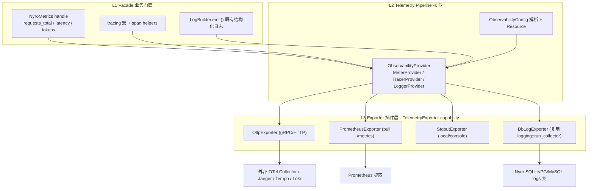

# Nyro 可观测性框架设计 RFC

> 状态:Draft · 关联文档:[lifecycle.md](./lifecycle.md)(本框架的 `TelemetryExporter` 是其扩展层的一个 capability)、[architecture.md](./architecture.md)

---

## 1. 背景与目标

Nyro 正在从"本地代理网关"演进为工业级 AI 网关。当前可观测性能力分散且有限:

- `tracing` subscriber 在三个 binary 各自初始化、过滤器不统一(`src-server/src/main.rs`、`src-tauri/src/lib.rs`、`crates/nyro-tools`)。
- 结构化请求日志走独立数据面:`LogBuilder.emit()` → `send_log()` → `mpsc` → `logging::run_collector()` → DB(`crates/nyro-core/src/logging/mod.rs`)。
- **没有** metrics / OpenTelemetry 任何依赖;`proxy/context.rs` 的 `TraceEvent` 注释明确写明 "P2-F will replace with OpenTelemetry"。

本 RFC 设计一套以 **OpenTelemetry 为统一底座** 的框架级可观测性架构。

### 设计目标

- **业务解耦**:业务代码只面向 Facade(typed instrument 句柄 + `tracing` 宏),不感知具体后端。
- **三信号统一**:metrics / traces / logs 共用一套 OTel SDK 与 `Resource`,通过 `request_id` 语义关联。
- **配置可插拔**:按配置启停每个信号、挂载任意多个 exporter(OTLP / Prometheus / stdout / 复用 DB log)。
- **传输层无关**:`nyro-core` 拥有全部可观测逻辑,binary 只调用 `observability::init()`。
- **默认零开销**:未启用时所有信号走 no-op provider;启用时用预注册 instrument(原子变量)+ 批量异步导出,规避锁竞争。

### 非目标

- 不引入动态加载/WASM 形式的 exporter(由 [lifecycle.md](./lifecycle.md) 统筹未来演进)。
- 不替换现有 DB 审计日志;DB log 被纳入框架成为一个一等 exporter,而非废弃。

---

## 2. 三层 / 三信号架构

本框架采用 **Facade(门面)+ Pipeline(管线)+ Exporter(导出器)** 三层,统一承载 metrics / traces / logs 三信号。



- **L1 Facade**:`NyroMetrics`(进程内一次性创建的 typed instrument 句柄)+ `tracing` 生态 + 既有 `LogBuilder`。业务侧禁止直接 import 任何 exporter。
- **L2 Pipeline**:`ObservabilityProvider` 从 `ObservabilityConfig` 构建三个 OTel provider,组装 `Resource`(`service.name`/`service.version`/`deployment.environment`),返回 `TelemetryGuard`(Drop 时 flush)。
- **L3 Exporter**:统一 `ExporterFactory` 抽象 + 注册表(沿用现有 `inventory` 模式,见 `integrations/hooks.rs`),新 exporter 通过注册即插入,无需改核心。该层即扩展框架的 `TelemetryExporter` capability(见 [lifecycle.md](./lifecycle.md))。

---

## 3. 内核 vs 插件:职责边界

可观测性功能不是一刀切做成插件。**"测什么 / 在哪测" 是框架内核职责;"上报到哪、额外测什么" 是插件职责。**

| 关注点 | 归属 | 说明 |
|---|---|---|
| OTel SDK 初始化、三 Provider、`Resource` | 内核(常驻 core) | 必须始终在场、与管线深耦合 |
| `request_id` / trace 上下文贯穿 | 内核 | 由 `PhaseCtx`/`RequestContext` 承载(见 lifecycle.md) |
| 核心指标权威埋点 | 内核 | `LogBuilder.emit()` 派生 requests_total / latency / tokens,单点埋点 |
| 新增上报后端(OTLP/Prometheus/...) | 插件 | `TelemetryExporter` capability,配置即插拔 |
| 自定义业务指标 / 日志富化 / 采样 | 插件 | `OnLog` PhaseFilter,拿只读快照异步打点 |

---

## 4. 核心抽象 (Traits)

不重新发明 metric 数据模型:以 OTel SDK 类型为通用语言(`opentelemetry::metrics::{Meter, Counter, Histogram}`)。`ExporterFactory` 只负责把对应 OTel exporter 接到 provider 上。

```rust
// crates/nyro-core/src/observability/exporter/mod.rs
pub enum SignalKind { Metrics, Traces, Logs }

/// 一个 exporter 工厂:声明支持哪些信号,从配置片段构建并挂入 pipeline builder。
pub trait ExporterFactory: Send + Sync {
    fn kind(&self) -> &'static str;                 // "otlp" | "prometheus" | "stdout" | "nyro-db"
    fn supports(&self, signal: SignalKind) -> bool;
    fn install(&self, cfg: &ExporterConfig, builder: &mut PipelineBuilder) -> anyhow::Result<()>;
}

/// `inventory` 注册记录,与 RequestHookRegistration 模式一致。
pub struct ExporterRegistration {
    pub make: fn() -> Box<dyn ExporterFactory>,
}
inventory::collect!(ExporterRegistration);
```

`DbLogExporter` 把现有 `logging::run_collector()` → DB(`crates/nyro-core/src/logging/mod.rs`)封装为框架内的一等 log exporter,实现"既有审计日志"与"新可观测框架"的统一,而非另起炉灶。

---

## 5. 模块布局

新增 `crates/nyro-core/src/observability/`:

| 文件 | 职责 |
|---|---|
| `mod.rs` | 公开 API:`init(cfg) -> Result<TelemetryGuard>`、`metrics() -> &NyroMetrics`、`shutdown()` |
| `config.rs` | `ObservabilityConfig` 全套 serde 结构(见 §6) |
| `resource.rs` | 构建 OTel `Resource` |
| `metrics.rs` | `NyroMetrics` typed instrument 注册表(预注册,低分配) |
| `tracing.rs` | 统一 subscriber 装配:`EnvFilter` + fmt layer + `tracing-opentelemetry` layer;span helpers |
| `logs.rs` | log 信号桥接(DB sink 默认 + 可选 OTLP logs) |
| `pipeline.rs` | `PipelineBuilder`,按配置遍历 `ExporterFactory` 装配三 provider |
| `exporter/{mod,otlp,prometheus,stdout,db_log}.rs` | trait + 内置工厂 |

`lib.rs` 增加 `pub mod observability;`,`Gateway` 启动序列持有 `TelemetryGuard`。

---

## 6. 配置 Schema(serde,英文默认值)

挂到 `GatewayConfig`(`crates/nyro-core/src/config.rs`)新增 `observability: ObservabilityConfig`,并贯通三种配置来源:`src-server` CLI/env、`src-server/src/yaml_config.rs`、`src-tauri` 默认。

```yaml
observability:
  enabled: false                 # 总开关,默认关闭(桌面端默认全禁用,保证数据不离开本机)
  service_name: "nyro"           # 默认英文
  resource_attributes:
    deployment.environment: "production"

  metrics:
    enabled: false
    exporters: ["prometheus"]    # prometheus | otlp | stdout
    prometheus:
      listen: "127.0.0.1:9090"
      path: "/metrics"
    otlp:
      endpoint: "http://127.0.0.1:4317"
      protocol: "grpc"           # grpc | http
      interval_secs: 30

  traces:
    enabled: false
    exporters: ["otlp"]
    sampler: "parent_based_traceid_ratio"
    ratio: 0.1

  logs:
    exporters: ["nyro-db"]       # 默认保持现状(DB 审计);可加 "otlp"
```

设计说明:大部分为启动期静态配置;预留 admin `settings` 表运行时开关(对齐现有 `enable_payload` / `config_epoch` 热更新机制,`admin/settings.rs`)作为后续阶段。

---

## 7. 与现有代码的插桩对接点

| 层级 | 文件 | 插桩内容 |
|---|---|---|
| 根 span / request_id 关联 | `proxy/context.rs::inject_context` | 用真实 OTel span 替换占位 `TraceEvent`/`TraceSink` |
| 编排阶段 span + 指标 | `proxy/dispatcher/` | route/auth/hooks/target/upstream 各阶段 |
| 指标单一发射点 | `LogBuilder::emit()`(`dispatcher/mod.rs`) | 从 `LogEntry`(已含 latency / usage / upstream_status / stream metrics)派生 `requests_total`、`latency_histogram`、`tokens_total`、`upstream_status` |
| 健康 gauge | `router/health.rs` | target 熔断状态 |
| 自定义观测 | `OnLogHook`(见 lifecycle.md) | 业务侧扩展埋点 |

---

## 8. 生命周期与性能防御

- **初始化**:三 binary 统一改为 `observability::init(&cfg.observability)`,返回 `TelemetryGuard` 持有至进程退出。
- **关闭**:Drop / 显式 `shutdown()` 触发批处理 flush(`BatchSpanProcessor` / periodic reader)。
- **性能**:
  1. 预注册 instrument(原子,无每调用分配)。
  2. 批量异步导出,无重锁(避免 `std::sync::Mutex` 高频争用)。
  3. **强制低基数**:禁止将 `api_key_id`、`user_id`、`timestamp`、model 实例等高基数动态变量作为 metric label;高基数信息只进 DB log / trace attribute。

---

## 9. 分阶段落地路线

- **Phase 0**:配置 schema + 模块骨架 + 统一 subscriber init(默认禁用 / no-op,零行为变更)。
- **Phase 1**:metrics 信号 —— `NyroMetrics` + Prometheus(`/metrics` 路由)+ OTLP;从 `LogBuilder::emit()` 与 dispatcher 发射。
- **Phase 2**:traces 信号 —— `tracing-opentelemetry` 桥接,真实 span 取代 `TraceEvent`,OTLP traces。
- **Phase 3**:logs 信号 —— OTLP log 桥接与 DB 并存;admin UI 运行时开关。

---

## 10. 依赖与风险

- **新增 crate**:`opentelemetry`、`opentelemetry_sdk`、`opentelemetry-otlp`、`tracing-opentelemetry`;Prometheus 拉取用 `opentelemetry-prometheus` 或 `prometheus` crate(该 crate 生态版本需在实现期校准)。
- **风险**:OTel Rust API 仍在演进 → 通过自有 `ExporterFactory` / `PipelineBuilder` 抽象隔离上游 breaking change;桌面端默认全禁用以保证"数据不离开本机"承诺。
