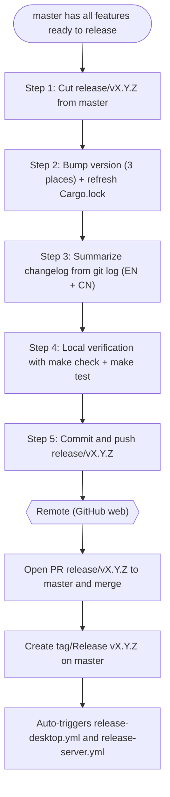

# Release Process (Local)

This document describes the **local work required to release a Nyro version**. The local part ends once the `release/vX.Y.Z` branch is pushed; **PR merge and tagging are done remotely on GitHub**.

Versions follow semantic versioning `vX.Y.Z` (e.g. `v1.7.6`). Below, `vX.Y.Z` is the target version and `X.Y.Z` is the version without the `v` prefix.

## Overview



> Everything after the remote node (PR merge, tagging) is performed remotely, not locally; it is listed here only for context.

## Step 1: Cut the release branch from master

```bash
git checkout master
git pull
git fetch --tags --prune --prune-tags  # sync tags with remote (tags are created on GitHub)
git checkout -b release/vX.Y.Z
```

> Tags are created remotely on GitHub, so always `fetch --tags` before determining the previous version. Otherwise `git describe` / `git tag -l` may report a stale tag and the changelog range will be wrong.

## Step 2: Bump the version

Manually update the version in the following **3 places**, keeping them identical:

| File | Field |
|------|-------|
| `Cargo.toml` | `[workspace.package].version` |
| `src-tauri/tauri.conf.json` | `version` |
| `webui/package.json` | `version` |

Then refresh `Cargo.lock` (**do not edit it by hand**) so the 4 workspace member crates align automatically:

```bash
cargo update -w
# or just run cargo build / cargo check, which also refreshes Cargo.lock
```

## Step 3: Generate and update the Changelog (core)

The changelog content is derived from **all commits since the last version tag**, summarized into a new version entry.

1. Collect the commits:

```bash
git --no-pager log $(git --no-pager describe --tags --abbrev=0)..HEAD --no-merges --oneline
```

> Use `--no-pager` so the command prints directly without opening the `less` pager (which would otherwise require `q` to exit).

2. Summarize into the following three categories, each annotated with its PR number (consistent with the existing changelog style):
   - Features
   - Improvements / Refactors
   - Fixes

3. Write the entry into both changelogs, at the top (latest) position:
   - `CHANGELOG.md` (English, **canonical**)
   - `CHANGELOG_CN.md` (Chinese)

Follow the existing entry format (version heading, release date, category sections, `(#PR)` annotations). The two files must stay in sync; English is the default/authoritative version.

## Step 4: Local verification

Run the pre-release verification:

```bash
make check
make test
```

Proceed only after both pass.

## Step 5: Commit and push the branch

```bash
git add -A
git commit -m "chore: release vX.Y.Z"
git push -u origin release/vX.Y.Z
```

This completes the local work.

## Remote follow-up (GitHub web, not local steps)

1. Open a PR on GitHub: `release/vX.Y.Z` → `master`, title `chore: release vX.Y.Z`, review and merge.
2. After merging, create the tag / Release `vX.Y.Z` on `master`.
3. Pushing the tag automatically triggers the following workflows (both triggered by `push tags: v*`):
   - `.github/workflows/release-desktop.yml`: builds desktop bundles, generates `latest.json` (`scripts/release/gen_latest_json.py`), creates the GitHub Release, and bumps the Homebrew Cask.
   - `.github/workflows/release-server.yml`: builds the server binaries for each platform.

## Appendix: Local changed files

A release typically touches the following files locally (see PR #185 `release/v1.7.6`):

| File | Change |
|------|--------|
| `Cargo.toml` | Workspace version |
| `Cargo.lock` | Auto-refreshed with the version bump |
| `src-tauri/tauri.conf.json` | Desktop version |
| `webui/package.json` | WebUI version |
| `CHANGELOG.md` | New version entry (English) |
| `CHANGELOG_CN.md` | New version entry (Chinese) |
