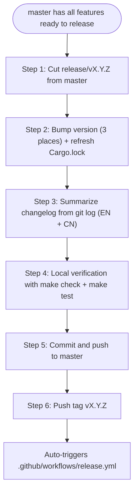

# Release Process (Local)

This document describes the **local work required to release a Nyro version**. After the release commit lands on `master`, pushing the `vX.Y.Z` tag triggers `.github/workflows/release.yml`.

Versions follow semantic versioning `vX.Y.Z` (e.g. `v1.7.6`). Below, `vX.Y.Z` is the target version and `X.Y.Z` is the version without the `v` prefix.

## Overview


```mermaid
flowchart TD
    start([master has all features ready to release]) --> cut["Step 1: Cut release/vX.Y.Z from master"]
    cut --> bump["Step 2: Bump version (3 places) + refresh Cargo.lock"]
    bump --> changelog["Step 3: Summarize changelog from git log (EN + CN)"]
    changelog --> verify["Step 4: Local verification with make check + make test"]
    verify --> push["Step 5: Commit and push to master"]
    push --> tag["Step 6: Push tag vX.Y.Z"]
    tag --> ci["Auto-triggers .github/workflows/release.yml"]
```

> Pushing an annotated `vX.Y.Z` tag on `master` builds the Linux server binary and publishes the GitHub Release. Desktop installers stay opt-in via `workflow_dispatch` (`build_desktop=true`).

## Step 1: Cut the release branch from master

```bash
git checkout master
git pull
git fetch --tags --prune --prune-tags
git checkout -b release/vX.Y.Z
```

> Always `fetch --tags` before determining the previous version. Otherwise `git describe` / `git tag -l` may report a stale tag and the changelog range will be wrong.

## Step 2: Bump the version

Manually update the version in the following **3 places**, keeping them identical:

| File | Field |
|------|-------|
| `Cargo.toml` | `[workspace.package].version` |
| `src-tauri/tauri.conf.json` | `version` |
| `webui/package.json` | `version` |

Then refresh `Cargo.lock` (**do not edit it by hand**) so the 4 workspace member crates align automatically:

```bash
cargo update -w
# or just run cargo build / cargo check, which also refreshes Cargo.lock
```

## Step 3: Generate and update the Changelog (core)

The changelog content is derived from **all commits since the last version tag**, summarized into a new version entry.

1. Collect the commits:

```bash
git --no-pager log $(git --no-pager describe --tags --abbrev=0)..HEAD --no-merges --oneline
```

> Use `--no-pager` so the command prints directly without opening the `less` pager (which would otherwise require `q` to exit).

2. Summarize into the following three categories, each annotated with its PR number (consistent with the existing changelog style):
   - Features
   - Improvements / Refactors
   - Fixes

3. Write the entry into both changelogs, at the top (latest) position:
   - `CHANGELOG.md` (English, **canonical**)
   - `CHANGELOG_CN.md` (Chinese)

Follow the existing entry format (version heading, release date, category sections, `(#PR)` annotations). The two files must stay in sync; English is the default/authoritative version.

## Step 4: Local verification

Run the pre-release verification:

```bash
make check
make test
```

Proceed only after both pass.

## Step 5: Commit and push

```bash
git add -A
git commit -m "chore: release vX.Y.Z"
git push origin master
# or, if using a release branch: git push -u origin release/vX.Y.Z
# then merge that PR to master before tagging
```

## Step 6: Push the version tag

The tag must point at the release commit on `master`. Pushing it starts `.github/workflows/release.yml`:

```bash
git tag -a vX.Y.Z -m "Nyro vX.Y.Z"
git push origin vX.Y.Z
```

The tag-push run:

- validates that `Cargo.toml`, `src-tauri/tauri.conf.json`, and `webui/package.json` all match `X.Y.Z`
- builds the WebUI and the Linux x86_64 server binary
- creates the GitHub Release `vX.Y.Z` with those assets (`publish=true`, `build_desktop=false`)

Manual `workflow_dispatch` remains available to republish from `master` or to set `build_desktop=true` for signed desktop installers. Do not dispatch `publish=true` for a tag that already has a GitHub Release.

## Appendix: Local changed files

A release typically touches the following files locally (see PR #185 `release/v1.7.6`):

| File | Change |
|------|--------|
| `Cargo.toml` | Workspace version |
| `Cargo.lock` | Auto-refreshed with the version bump |
| `src-tauri/tauri.conf.json` | Desktop version |
| `webui/package.json` | WebUI version |
| `CHANGELOG.md` | New version entry (English) |
| `CHANGELOG_CN.md` | New version entry (Chinese) |
